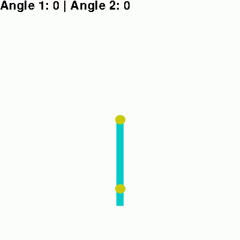

# RL Control of a Constrained Underactuated Double Pendulum


## Overview

This project, which was proposed for a possible participation at the 3rd AI Olympics with RealAIGym at ICRA 2025, explores the recovery of a simulated Pendubot system after it falls from its unstable upright equilibrium. The goal was to design a strategy capable of bringing the system back to the balanced state while staying within position and velocity constraints. The attempts focused on modifying the simulation environment to disturb the system, shaping the reward function based on constraint violation and applying curriculum learning to first learn the swing-up maneuver and then discover how to re-stabilize after falling. The outcome is a policy that is able to recover from a fall within the joint position constraints enforced by the competition.

This repository includes:
- Environment setup,  
- Training and evaluation scripts,  
- The final project report with figures and experimental results.

---

## Repository structure

```
.
├── controller/                # implementation of different controllers (given)
├── model/                     # mathematical model of the double pendulum (given)
├── model_default/             # default model, i.e trained without penalties and disturbances
├── model_penalty_*            # variants with constraint penalties
├── parameters/                # simulation parameters
├── simulation/                # environment definition
├── utils/                     # utilities such as reset and plotting functions
├── train.py                   # main SAC training script
├── train_loose.py             # relaxed constraint variant
├── train_strict.py            # strict constraint variant
├── evaluate.py                # policy evaluation script
├── RL_Project_Report.pdf      # full project report (contains plots)
```

---

## Requirements

Recommended environment (Python ≥ 3.8):

- `numpy`
- `scipy`
- `matplotlib`
- `gymnasium`
- `torch`
- `stable-baselines3`

---

### Train a policy

```bash
# default configuration
python train.py

# variants
python train_loose.py
python train_strict.py
```

---

### Evaluate a trained policy

```bash
# default configuration
python train.py

# variants
python train_loose.py
python train_strict.py
```

As requested by the assignment, each model has its own training and evaluation script. 

Evaluations render the pendulum motion and outputs performance statistics.


